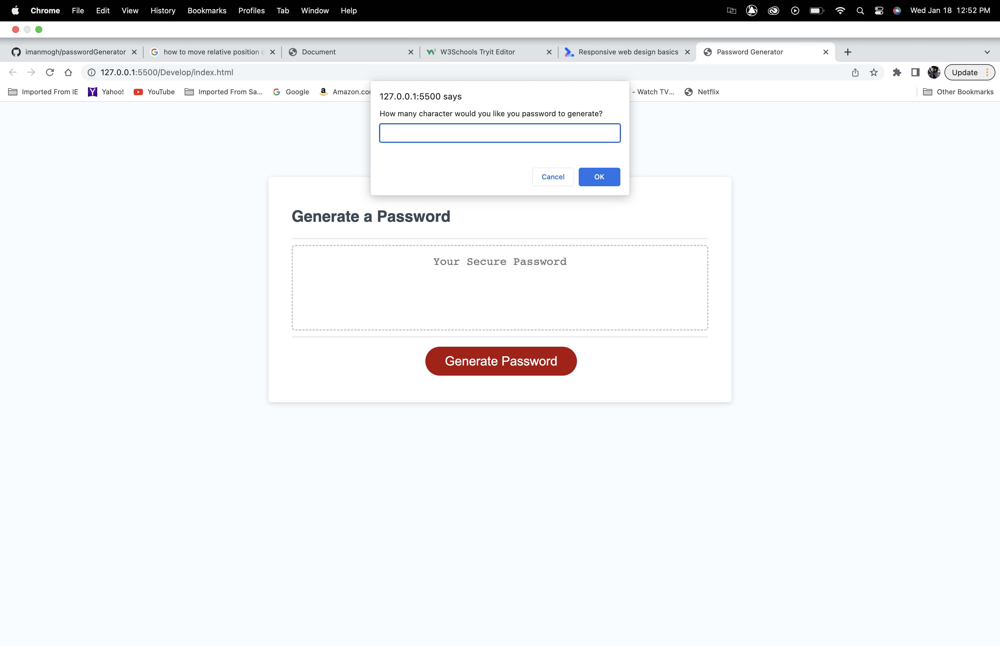
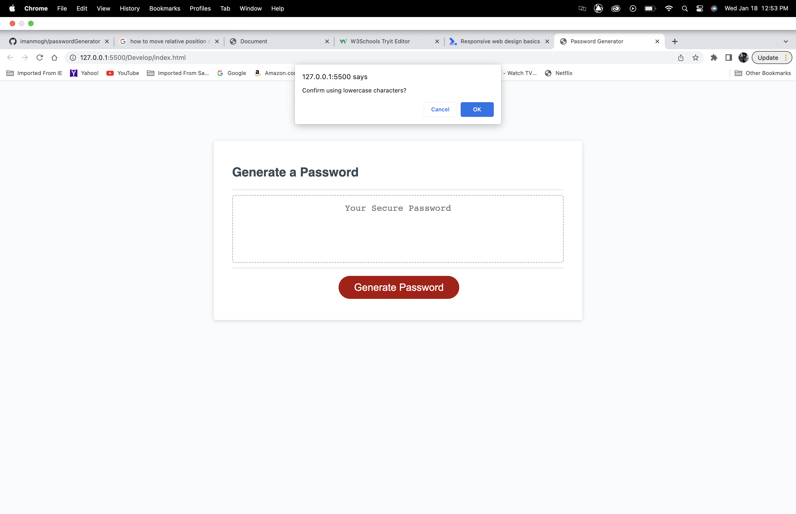
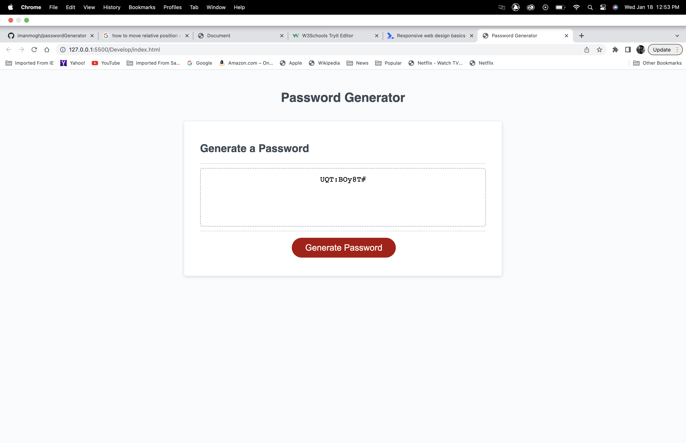

# Passwrod Generator

## Description

The password generator generates a new password after answering a few prompts

## Installation

N/A

## Usage

To use the password Generator answer the prompts about:
1. What do you want the length of the password to be
2. Confirm using uppercase characters
3. Confirm using lowercase characters
4. Confirm using numbers
5. Confirm using special characters

## Credits

https://github.com/imanmogh/passwordGenerator

## License

M/A